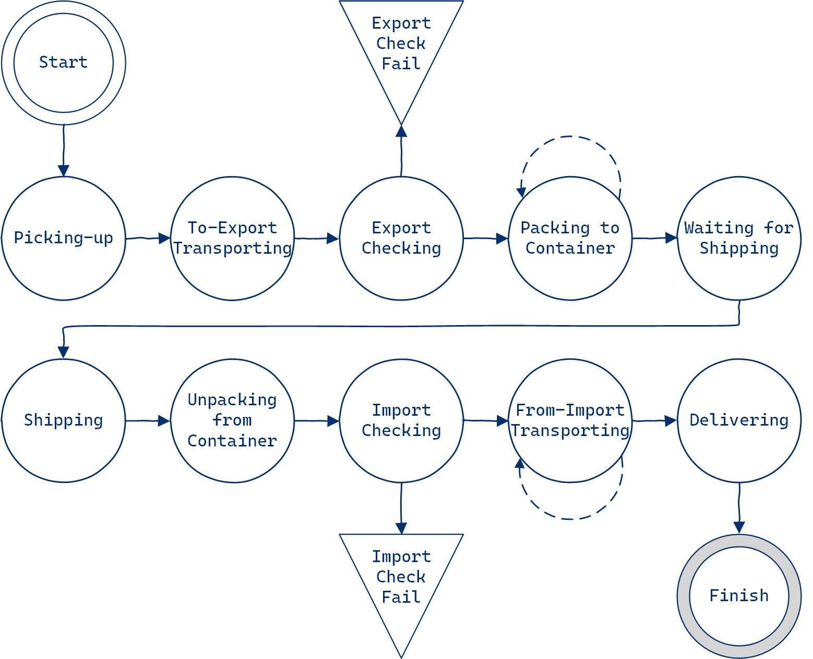

# CS307 2022Fall Project2 Q\&A

## Questions and Answers

- Exactly which APIs change the item states?
  - The questions mainly focus on the states between `Export Checking` and `From-Import Transporting`, whose state changes are triggered by:
    1. At `Export Checking`, there is only an API `setItemCheckState` which can set `Export Checking` to `Packing to Container` or `Export Check Fail`. If the item's state is set to `Packing to Container` via **this API**, its `Container Code` and `Container Type` will be empty.
    2. At `Packing to Container`, there is an API `loadItemToContainer` which can set `Packing to Container` to `Packing to Container` with a side effect that sets the empty `Container Code` and `Container Type` to the API input parameter. This state transition is represented by the dotted line in the figure below.
    3. At current state, i.e., the `Container Code` is not empty, API `loadItemToContainer` can still be invoked to change the `Container Code` and/or `Container Type`. As noted in the documentation, one container can contains at most one item.
    4. At `Packing to Container`, there is also an API `loadContainerToShip` which can set `Packing to Container` to `Waiting for Shipping` if neither the item's `Container Code` nor its `Container Type` is empty.
    5. Only `shipStartSailing` can set `Waiting for Shipping` to `Shipping`.
    6. Only `unloadItem` can set `Shipping` to `Unpacking from Container`.
    7. Only `itemWaitForChecking` can set `Unpacking from Container` to `Import Checking`.
    8. At `Import Checking`, there is only an API `setItemCheckState` which can set `Import Checking` to `From-Import Transporting` or `Import Check Fail`. If the item's state is set to `From-Import Transporting` via **this API**, its `Delivery Courier` will be empty.
    9. At `From-Import Transporting`, if the `Delivery Courier` is empty, any courier working at the items `Delivery City` can invoke `setItemState` API to set its state from `From-Import Transporting` to `From-Import Transporting` with a side effect that sets the `Delivery Courier` to his/her name.  This state transition is represented by the dotted line in the figure below.
    10. At current state, i.e., the `Delivery Courier` is not empty, only the item's `Delivery Courier` can invoke `setItemState` API to set item's state from `From-Import Transporting` to later ones.

  - If the current local judge returns otherwise, please refer to this Q\&A supplement since it will be updated more often.
  - Most of the details in this answer are mentioned in the documentation, however, they are separated at different APIs on different pages. We apologize for the additional comprehension obstacles.

- Which items shall the API `getItemsAtPort` return?
  - As described in the documentation: "items currently waiting at this officer’s working seaport".
  - We apologize for the bug in the local judge of this API, which will be fixed soon.

- Is there any time-related constraints?
  - No. Otherwise this project would be too complicated.

